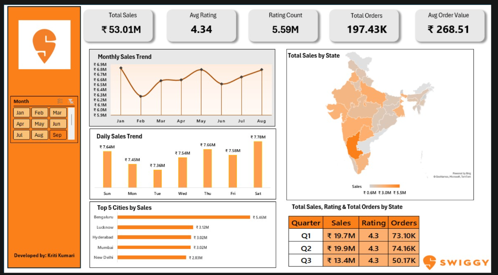

#  Swiggy Sales Performance Dashboard

## About the Project  
This project focuses on analyzing Swiggy’s sales performance and customer feedback using an interactive Excel dashboard. The objective was to track revenue trends, regional performance, order volumes, and customer satisfaction to better understand market behavior.

Raw transactional data was cleaned and transformed in Excel to build a clear, visual reporting system that highlights peak sales periods, top-performing cities, and regional demand patterns.

---

## Tools Used  
- **MS Excel** – Data cleaning, processing, and dashboard creation  
- **Pivot Tables & Pivot Charts** – Aggregating data and building dynamic visuals  
- **Excel Formulas** – Calculating KPIs and business metrics  
- **Slicers** – Interactive filtering by month  

---

## Key Business Metrics  
- **Total Sales:** ₹53.01M  
- **Total Orders:** 197.43K  
- **Average Order Value:** ₹268.51  
- **Average Rating:** 4.34  
- **Rating Count:** 5.59M  

These metrics provide a quick overview of Swiggy’s operational scale, customer engagement, and revenue per order.

---

## Dashboard Insights  

###  Sales Trends  
- Monthly sales trend line chart to identify seasonal growth  
- Daily sales bar chart highlighting peak order days  

###  Regional Performance  
- State-wise sales distribution using a map chart  
- Top 5 revenue-generating cities including Bengaluru, Lucknow, Hyderabad, Mumbai, and New Delhi  

###  Quarterly Overview  
- Quarter-wise breakdown of Sales, Orders, and Ratings (Q1–Q3)  
- Clear comparison of performance across different time periods  

---

## Key Observations  
- **Top City:** Bengaluru leads with ₹5.46M in total sales  
- **Day-wise Demand:** Saturdays show the highest sales at ₹7.78M  
- **Customer Satisfaction:** Average rating remains consistently high at ~4.3 across all quarters  
- **Quarterly Performance:** Q2 records the highest sales (₹19.9M) and order volume (74.16K)  

---

## Business Takeaways  
- **Weekend Strategy:** Marketing campaigns and delivery partner incentives should focus on weekends, especially Saturdays  
- **Regional Growth:** Cities like Lucknow and Hyderabad show strong potential for further expansion  
- **Revenue Optimization:** Combo deals and upselling strategies can help increase the average order value beyond ₹300  
- **Customer Retention:** High rating volume indicates an engaged user base; loyalty programs can sustain repeat orders  

---

## Dashboard Features  
- **Month-wise Slicer:** Filter data from January to September  
- **Dynamic KPIs:** Scorecards update automatically based on selected filters  
- **Geospatial View:** Map visual highlights high-revenue states at a glance  

---

## Dashboard Preview  

---

## Created By  
**Kriti Kumari**

